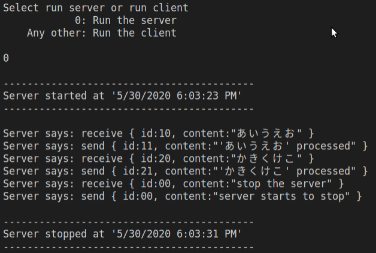
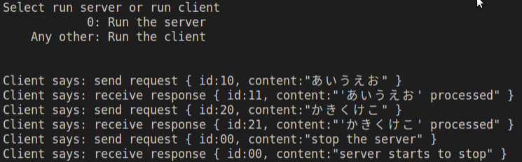

# tcpip-ex01-dotnetcore
## .net core TCPIP 練習

Exercise for TCPIP communication by using .net core. 
Just a simple exersice for localhost communication.
  - Program "client" sends request to "server" and "server" reponses.
  - Print request/response contents to console screen.
  - Request/respone contents are using UTF8 for asia text.
  - Requests are like:
  
        { id:10, content:"あいうえお" }
        { id:20, content:"かきくけこ" }
        { id:00, content:"stop the server" } // Client send this request to stop the server program.
  - Reponses are like:
  
        { id:11, content:"'あいうえお' processed" }
        { id:21, content:"'かきくけこ' processed" }
        { id:00, content:"server starts to stop" } // Response and stop the server

### Screenshots
  - Server 
  
  - Client 
  
